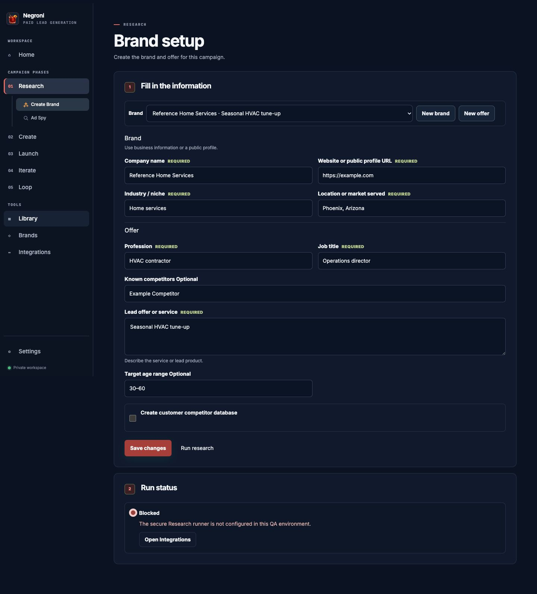

<p align="center">
  
</p>

<h1 align="center">Negroni</h1>

<p align="center">
  <strong>The open-source AI ad agency—with old-school taste and new-school controls.</strong>
</p>

<p align="center">
  Research → Creative → Launch → Iteration → Loop
</p>

<p align="center">
  
  
  
  
</p>

Negroni is an open-source, agent-native advertising system. Install it as a
plugin, connect the data sources you authorize, and use a private live Site as
the durable campaign workspace.

The Codex and ChatGPT plugin is the primary distribution. The same phase skills
and stable tool contracts are designed for Gemini and other compatible agent
harnesses. The React application in [`app/`](app/) is the Sites workspace, not
a separate product users must install and operate.

The product is organized around five connected phases:

1. **Research** — understand the client, the customer, and the competitors.
2. **Creative** — turn research into image and video ad concepts and variants.
3. **Launch** — convert approved creative into a validated media plan and place
   it in an ad account with explicit budgets, rules, tracking, and approvals.
4. **Iteration** — design controlled tests, evaluate evidence, and decide what
   to keep, stop, or test next.
5. **Loop** — continuously turn results into new research, creative, launches,
   and experiments.

## Why Negroni

Most AI advertising tools stop at asset generation. Negroni treats advertising
as a connected operating system: research creates evidence, creative turns
evidence into testable assets, launch applies an approved plan, iteration
measures a declared hypothesis, and the loop compounds what the system learns.

The repository is built for practitioners who want agent leverage without
giving an agent silent authority over spend, customer data, or live accounts.

## What works today

Negroni is in beta. The repository is now a validated Codex plugin with a
portable onboarding skill, one skill for each phase, and Draper as the
conversational control plane. [`app/`](app/) is the live Sites workspace and
currently includes:

- an interactive view of all five phases and their artifact handoffs;
- an owner-scoped project draft flow with explicit external-action boundaries;
- responsive desktop and mobile layouts.

Phase 1 currently includes:

- a responsive Research intake and deliverables interface;
- strict server-response and output validation;
- secret and example-leak detection;
- desktop and mobile visual QA;
- a server-only Meta Ads Intelligence adapter with project-isolated profiles,
  deterministic daily deltas, five durable Research artifact receipts, and a
  compact competitor-ad results module;
- a separate local-first Meta Ads Intelligence engine provided as a local
  companion checkout at `meta-ads-intelligence/` (not included in this repository).
- a provider-neutral competitor-research CLI with sanitized two-night fixtures,
  isolated SQLite, immutable receipts, fake Sheets/Drive projections,
  deterministic recovery, and an approval-locked Creative handoff;
- a cache-portable Negroni MCP with seven fail-closed tools for capability and
  Learning Core status, Draper queries and local decisions, competitor runs,
  resume, and immutable artifact inspection;
- a fixture-backed central Learning Core with an authoritative SQLite catalog,
  FTS5, rebuildable vectors, SHA-256 media references, immutable learning
  versions, and a generated private Markdown vault; and
- an owner-scoped local research-runner boundary with strict five-prompt
  execution, resumable checkpoints, and immutable five-artifact receipts.

The plugin, Research interface, MCP, and local runner contract are validated.
The runner is not deployed and its default providers fail closed. Live
research remains blocked until an owner-controlled runner, research provider,
and verified Google Workspace output path are configured. Creative, Launch,
Iteration, and Loop currently have installable skills and implementation
contracts, but no live account adapter is claimed.

<p align="center">
  
</p>

## Product surfaces

| Surface | Role |
| --- | --- |
| **Negroni plugin** | Primary install and agent workflow |
| **Phase skills** | Portable Research, Creative, Launch, Iteration, and Loop playbooks |
| **Draper** | Conversational control plane over brand-scoped evidence, learnings, freshness, and reviewable proposals |
| **Negroni tools** | Seven installed local MCP tools wrap Draper, the Learning Core, and the stable competitor boundary; hosted provider actions remain blocked until deployment and authorization |
| **Sites workspace** | Private campaign data, artifacts, review, and approvals |
| **Local launcher** | Contributor development and an optional self-hosted fallback |

The source is public-compatible. Credentials, provider state, customer data,
collected media, and private campaign artifacts are not part of the plugin or
Git repository.

## Quick start for contributors

Requirements: Node.js 22.16 or newer and npm 11.

```bash
git clone https://github.com/gpfeff/negroni.git
cd negroni
npm run setup
npm run dev
```

Open the local URL printed by the development server.

### Development with the canonical local URL

For live development against this checkout, run:

```bash
npm run dev:local
```

Then open [http://127.0.0.1:3000/](http://127.0.0.1:3000/). This starts the
repository's watcher and the private credential broker together, so saved
source changes reload at that same URL. Only one Negroni local instance can
own ports 3000 and 47831 at a time: stop `negroni start` before switching to
`npm run dev:local`, and use `Ctrl-C` to stop the development instance before
switching back.

To run the older five-phase interface prototype instead:

```bash
npm run dev:web
```

Run the top-level UI build and full Phase 1 validation suite:

```bash
npm run validate
```

The stable competitor-research boundary is:

```bash
negroni research competitors run --project <research-set-id> --mode nightly --json
```

It also accepts `--dry-run`, `--resume-run <run-id>`,
`--provider <configured-provider>`, and a bounded `--deadline-seconds`. Exit 0
means complete/complete-zero; 3 means partial/suspect; 4 blocked/skipped; 5 a
persisted local failure; and 64 invalid CLI/configuration. The checked-in
vertical slice is sanitized and offline. It does not prove a live Meta, Google,
BrowserOS, paid collector, or scheduler capability.
Engine-backed tests require the local companion `meta-ads-intelligence` checkout
and are reported as skipped when it is absent; engine-independent tests always run.

The reviewed official Meta Graph API v26.0 boundary accepts up to 10 Page IDs
per Ads Archive request. Ordinary ads that reached no EU location are not
returned unless they are political or issue ads, so Negroni treats coverage—not
the number 10—as the live capability gate and requires a 2–3 Page-ID proof
before enabling an official adapter.

The installed plugin also exposes these bounded MCP tools:

- `capability_status`;
- `learning_core_status`;
- `draper_query`;
- `draper_record_decision`;
- `competitor_research` (dry-run by default);
- `resume_competitor_research`; and
- `inspect_research_artifact`.

They return sanitized receipts rather than raw process output or private paths,
and none can publish, spend, launch traffic, mutate an ad account, or install a
scheduler.

The local Draper rehearsal is:

```bash
negroni draper fixture rehearse --json
```

It uses only the sanitized fixture warehouse. The relational database remains
authoritative, the Obsidian-compatible vault is generated, and vector entries
can be rebuilt. See
[`app/docs/draper-learning-core.md`](app/docs/draper-learning-core.md) and the
[`Draper/Learning Core architecture decision`](docs/decisions/2026-07-30-draper-learning-core-architecture.md).

This starts and validates the local interface. A real Research run additionally
requires the server-side runner documented in
[`app/README.md`](app/README.md).

The local launcher is not the primary user experience. Contributors who need
the self-hosted fallback can follow
[local and private remote setup](docs/LOCAL-AND-REMOTE-SETUP.md).

## Workspace ownership

`/Users/greg-mac-mini/Developer/negroni` is the only authoritative Negroni
software repository. It contains source, tests, fixtures, package manifests and
lockfiles, build and CI configuration, schemas, migrations, repository docs,
sanitized examples, product-required static assets, canonical QA baselines, and
the scripts required to build, validate, package, or operate the project.

`/Users/greg-mac-mini/Documents/tools-negroni` is a synced, non-Git artifact
workspace. Put durable non-secret research outputs, reports, receipts, handoff
and review packets, exported non-baseline screenshots, generated deliverables,
migration archives, and machine-to-machine handoff material there.

`/Users/greg-mac-mini/.local/share/negroni` is private machine-local runtime
state. It owns databases, provider state, collected media, logs, caches,
credentials, cookies, tokens, private audiences, and local dependency
environments. Never put that data in the repository or synced Documents.

Before routing a file, make a recoverable private backup and compare SHA-256
hashes. Do not overwrite a different destination; preserve both versions in a
review packet instead.

## The operating loop

```text
Client goal
    ↓
Research brief
    ↓
Creative batch
    ↓
Approved launch plan
    ↓
Experiment results
    ↓
Learning ledger
    └──────────────→ new research and creative
```

Each phase produces a durable artifact for the next phase. This makes the work
reviewable by a human, portable across agent harnesses, and recoverable when an
automation fails.

## The five phases

### 1. Research

Research uses the **three Cs**:

- **Client:** the business paying for the campaign—its offer, economics,
  constraints, brand, proof, capacity, and definition of a qualified lead.
- **Customer:** the person the client needs to reach—their situation, intent,
  objections, language, awareness, motivations, and buying journey.
- **Competitors:** advertisers competing for the same attention or demand.
  Negroni studies their public ads, offers, hooks, formats, and landing-page
  patterns to identify opportunities.

Competitor research is evidence gathering, not asset copying. Negroni should
adapt patterns and strategic insights without reproducing protected creative,
impersonating another advertiser, or inventing performance claims.

Current Phase 1 implementations:

- [`app/`](app/) — canonical Negroni application. Research and its approval
  handoff are executable; Create opens only for an approved offer-scoped
  Research revision. Launch, Iterate, and Loop show their exact contracts and
  truthfully report that durable handoff verification is not connected yet.
- `meta-ads-intelligence/` — optional local companion checkout for intelligence
  from public Meta Ad Library observations. SQLite, media, lifecycle, human
  overrides, local reports, and optional cloud projection remain engine-owned.

The phase contract and build plan live in [`01-research/`](01-research/).

### 2. Creative

Creative converts approved research into a structured creative batch:
positioning, angles, hooks, scripts, copy, storyboards, image directions, video
directions, variants, and review evidence. Every asset must retain its source
brief and hypothesis so later performance can be traced back to the idea that
produced it.

See [`02-creative/`](02-creative/).

### 3. Launch

Launch prepares campaigns, ad sets or line items, audiences, placements,
budgets, naming, tracking, rules, and final QA. It separates generating a launch
plan from mutating a live ad account.

Live account writes, spend, and traffic are approval-gated. A dry run and a
human-readable launch diff should exist before any external change.

See [`03-launch/`](03-launch/).

### 4. Iteration

Iteration converts campaign questions into controlled experiments. It selects
the highest-value variable to test, defines the primary metric and guardrails,
sets decision thresholds, and records whether a variant won, lost, or remained
inconclusive.

See [`04-iteration/`](04-iteration/).

### 5. Loop

Loop is the compounding system. Inspired by
[Andrej Karpathy's `autoresearch`](https://github.com/karpathy/autoresearch),
it runs bounded experiments, measures the result, keeps or discards the change,
records the evidence, and proposes the next experiment.

Advertising loops require stronger controls than a local model-training loop.
Negroni must account for spend, attribution delay, sample size, lead quality,
creative fatigue, platform policy, and client capacity. Autonomous research and
drafting may run continuously; launches and budget changes remain governed by
an explicit approval policy.

See [`05-loop/`](05-loop/).

## Repository structure

```text
negroni/
├── app/                      # Canonical Negroni application
├── web/                      # Earlier five-phase interface prototype
├── 01-research/              # Three-C research contract and roadmap
├── 02-creative/              # Image and video creative contract and roadmap
├── 03-launch/                # Media-plan, account-change, and QA contract
├── 04-iteration/             # Experiment design and decision contract
└── 05-loop/                  # Continuous learning-loop contract and roadmap
```

Meta Ads Intelligence belongs to Research conceptually and is consumed through
a server-side CLI contract. The browser receives only a validated summary and
access-controlled report links; it never receives SQLite access, credentials,
local paths, or media paths.

## UI system

The canonical visual and interaction reference is
[`docs/UI.md`](docs/UI.md). Phase interfaces should reuse its tokens, status
language, approval boundaries, responsive rules, and QA requirements.

## Product principles

- **Harness-agnostic:** the workflow is defined by files, contracts, and
  commands rather than one model vendor.
- **Evidence before generation:** creative and targeting decisions must trace
  back to research or measured campaign results.
- **Human-governed spend:** planning can be autonomous; live account mutation
  requires an explicit approval policy and an auditable receipt.
- **One hypothesis at a time:** tests should isolate a meaningful variable
  whenever the platform and available traffic allow it.
- **No fake certainty:** unknown attribution, incomplete competitive coverage,
  and inconclusive experiments stay visibly unknown.
- **Local-first and portable:** source, schemas, and non-secret artifacts belong
  in the repository; credentials and private runtime data do not.
- **Portfolio-quality:** architecture, decisions, tests, and limitations should
  be understandable to a reviewer without private client data.

## Current status

Negroni is in alpha development. The five-phase interface and Research
implementation are active; Creative, Launch, Iteration, and Loop have phase
contracts and initial build plans but not production implementations.

No campaign launch, account mutation, budget change, or traffic activation is
authorized by this repository alone.

## Open-source release

Negroni is open-source software released under the
[`MIT License`](LICENSE).

## Contributing and security

Read [`CONTRIBUTING.md`](CONTRIBUTING.md) before proposing a change. Report
security concerns through the private process in [`SECURITY.md`](SECURITY.md);
never place credentials, customer data, or private campaign material in an
issue.
