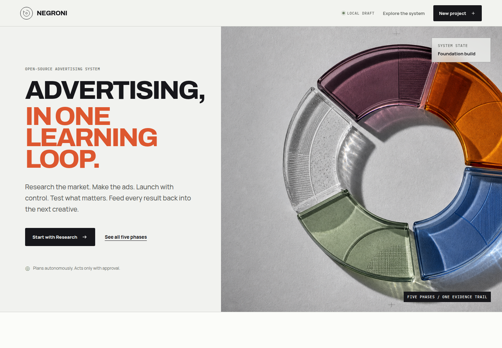
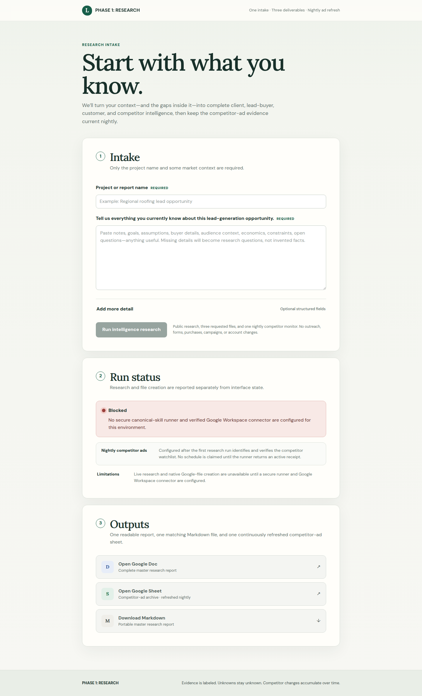

<p align="center">
  
</p>

<h1 align="center">Negroni</h1>

<p align="center">
  <strong>The open-source operating system for agent-native advertising.</strong>
</p>

<p align="center">
  Research → Creative → Launch → Iteration → Loop
</p>

<p align="center">
  
  
  
</p>

Negroni helps a person and their preferred AI harness move from market
understanding to launched, measured, and continuously improved lead-generation
campaigns.

Negroni is designed for paid social, in-app, and programmatic advertising. It
supports image and video creative and is intended to work with Codex, Claude
Code, or any other harness that can read the repository, invoke its tools, and
preserve its project artifacts.

The product is organized around five connected phases:

1. **Research** — understand the client, the customer, and the competitors.
2. **Creative** — turn research into image and video ad concepts and variants.
3. **Launch** — convert approved creative into a validated media plan and place
   it in an ad account with explicit budgets, rules, tracking, and approvals.
4. **Iteration** — design controlled tests, evaluate evidence, and decide what
   to keep, stop, or test next.
5. **Loop** — continuously turn results into new research, creative, launches,
   and experiments.

## Why Negroni

Most AI advertising tools stop at asset generation. Negroni treats advertising
as a connected operating system: research creates evidence, creative turns
evidence into testable assets, launch applies an approved plan, iteration
measures a declared hypothesis, and the loop compounds what the system learns.

The repository is built for practitioners who want agent leverage without
giving an agent silent authority over spend, customer data, or live accounts.

## What works today

Negroni is an alpha. The top-level product interface currently includes:

- an interactive view of all five phases and their artifact handoffs;
- a local-only project draft flow with explicit external-action boundaries;
- responsive desktop and mobile layouts.

Phase 1 currently includes:

- a responsive Research intake and deliverables interface;
- strict server-response and output validation;
- secret and example-leak detection;
- desktop and mobile visual QA;
- a separate local-first Meta Ads Intelligence engine under active integration.

The Research interface is validated, but live research remains intentionally
blocked until a secure runner and verified Google Workspace output path are
configured. Creative, Launch, Iteration, and Loop currently have defined
contracts and implementation roadmaps.

<p align="center">
  
</p>

<p align="center">
  
</p>

## Quick start

Requirements: Node.js 22.13 or newer and npm 11.

```bash
git clone https://github.com/gpfeff/negroni.git
cd negroni
npm run setup
npm run dev
```

Open the local URL printed by the development server.

To run the existing Phase 1 Research interface instead:

```bash
npm run dev:research
```

Run the top-level UI build and full Phase 1 validation suite:

```bash
npm run validate
```

This starts and validates the local interface. A real Research run additionally
requires the server-side runner documented in
[`phase-1-research/README.md`](phase-1-research/README.md).

## The operating loop

```text
Client goal
    ↓
Research brief
    ↓
Creative batch
    ↓
Approved launch plan
    ↓
Experiment results
    ↓
Learning ledger
    └──────────────→ new research and creative
```

Each phase produces a durable artifact for the next phase. This makes the work
reviewable by a human, portable across agent harnesses, and recoverable when an
automation fails.

## The five phases

### 1. Research

Research uses the **three Cs**:

- **Client:** the business paying for the campaign—its offer, economics,
  constraints, brand, proof, capacity, and definition of a qualified lead.
- **Customer:** the person the client needs to reach—their situation, intent,
  objections, language, awareness, motivations, and buying journey.
- **Competitors:** advertisers competing for the same attention or demand.
  Negroni studies their public ads, offers, hooks, formats, and landing-page
  patterns to identify opportunities.

Competitor research is evidence gathering, not asset copying. Negroni should
adapt patterns and strategic insights without reproducing protected creative,
impersonating another advertiser, or inventing performance claims.

Current Phase 1 implementations:

- [`phase-1-research/`](phase-1-research/) — research intake and deliverables
  interface.
- **Meta Ads Intelligence** — local-first intelligence from public Meta Ad
  Library observations; its reusable package is under public-release review.

The phase contract and build plan live in [`01-research/`](01-research/).

### 2. Creative

Creative converts approved research into a structured creative batch:
positioning, angles, hooks, scripts, copy, storyboards, image directions, video
directions, variants, and review evidence. Every asset must retain its source
brief and hypothesis so later performance can be traced back to the idea that
produced it.

See [`02-creative/`](02-creative/).

### 3. Launch

Launch prepares campaigns, ad sets or line items, audiences, placements,
budgets, naming, tracking, rules, and final QA. It separates generating a launch
plan from mutating a live ad account.

Live account writes, spend, and traffic are approval-gated. A dry run and a
human-readable launch diff should exist before any external change.

See [`03-launch/`](03-launch/).

### 4. Iteration

Iteration converts campaign questions into controlled experiments. It selects
the highest-value variable to test, defines the primary metric and guardrails,
sets decision thresholds, and records whether a variant won, lost, or remained
inconclusive.

See [`04-iteration/`](04-iteration/).

### 5. Loop

Loop is the compounding system. Inspired by
[Andrej Karpathy's `autoresearch`](https://github.com/karpathy/autoresearch),
it runs bounded experiments, measures the result, keeps or discards the change,
records the evidence, and proposes the next experiment.

Advertising loops require stronger controls than a local model-training loop.
Negroni must account for spend, attribution delay, sample size, lead quality,
creative fatigue, platform policy, and client capacity. Autonomous research and
drafting may run continuously; launches and budget changes remain governed by
an explicit approval policy.

See [`05-loop/`](05-loop/).

## Repository structure

```text
negroni/
├── web/                      # Interactive five-phase product interface
├── 01-research/              # Three-C research contract and roadmap
├── 02-creative/              # Image and video creative contract and roadmap
├── 03-launch/                # Media-plan, account-change, and QA contract
├── 04-iteration/             # Experiment design and decision contract
├── 05-loop/                  # Continuous research and optimization contract
└── phase-1-research/         # Existing Phase 1 research interface
```

Meta Ads Intelligence belongs to Research conceptually. Its current local
source has path-sensitive callers and runtime ownership, so it will enter the
public repository only after an isolated packaging and privacy review.

## UI system

The canonical visual and interaction reference is
[`docs/UI.md`](docs/UI.md). Phase interfaces should reuse its tokens, status
language, approval boundaries, responsive rules, and QA requirements.

## Product principles

- **Harness-agnostic:** the workflow is defined by files, contracts, and
  commands rather than one model vendor.
- **Evidence before generation:** creative and targeting decisions must trace
  back to research or measured campaign results.
- **Human-governed spend:** planning can be autonomous; live account mutation
  requires an explicit approval policy and an auditable receipt.
- **One hypothesis at a time:** tests should isolate a meaningful variable
  whenever the platform and available traffic allow it.
- **No fake certainty:** unknown attribution, incomplete competitive coverage,
  and inconclusive experiments stay visibly unknown.
- **Local-first and portable:** source, schemas, and non-secret artifacts belong
  in the repository; credentials and private runtime data do not.
- **Portfolio-quality:** architecture, decisions, tests, and limitations should
  be understandable to a reviewer without private client data.

## Current status

Negroni is in alpha development. The five-phase interface and Research
implementation are active; Creative, Launch, Iteration, and Loop have phase
contracts and initial build plans but not production implementations.

No campaign launch, account mutation, budget change, or traffic activation is
authorized by this repository alone.

## Open-source release

The repository is being prepared for public release, but no license has been
selected yet. Until a license file is added, the source is visible work in
progress rather than a completed open-source distribution.

## Contributing and security

Read [`CONTRIBUTING.md`](CONTRIBUTING.md) before proposing a change. Report
security concerns through the private process in [`SECURITY.md`](SECURITY.md);
never place credentials, customer data, or private campaign material in an
issue.
